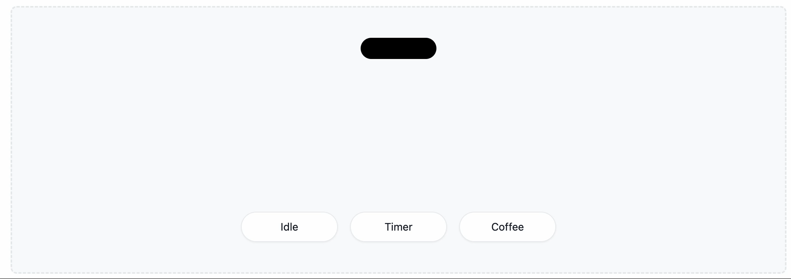
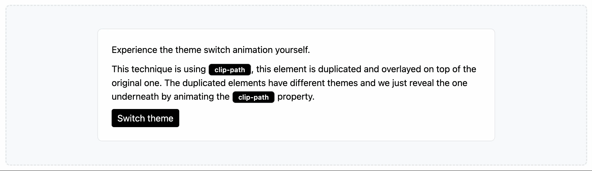
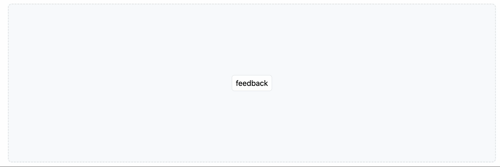
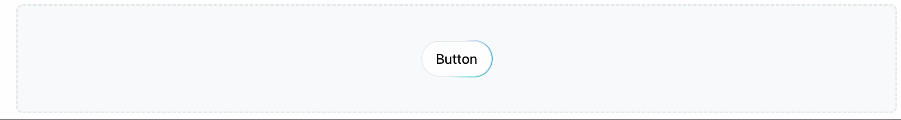
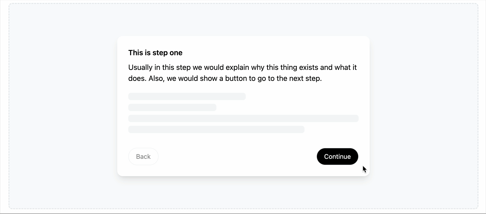
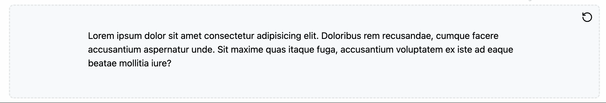
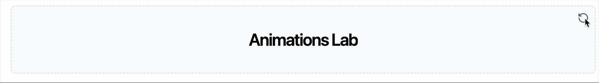
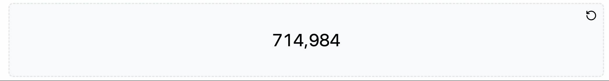

# Animations Lab

다양한 애니메이션을 연구하는 [실험실](https://animations-lab-jy.vercel.app/)입니다.

## Examples

### Dynamic Island

  

### Clip Path

  

### Popover

  

### Gradient Border

  

### Multi Step

  

### Animation Text

  

### Text Reveal

  

### Animation Counter

  
